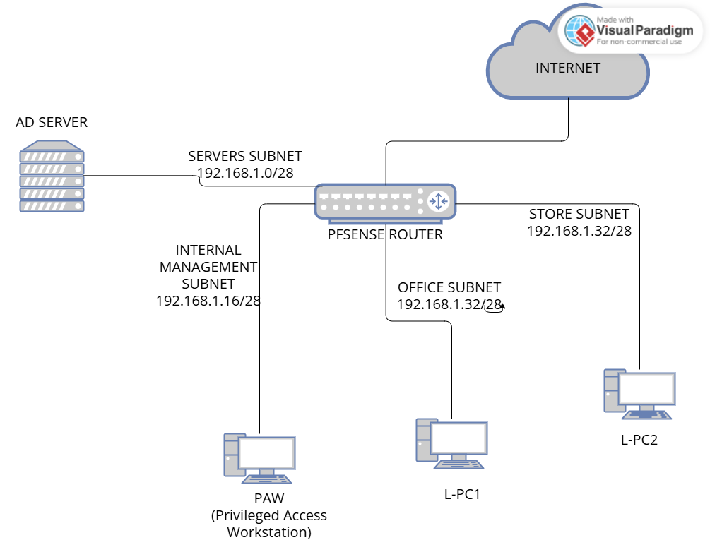
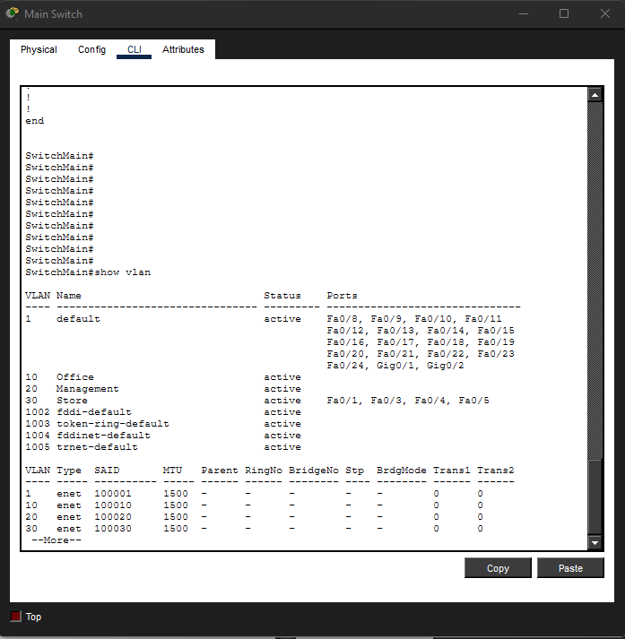
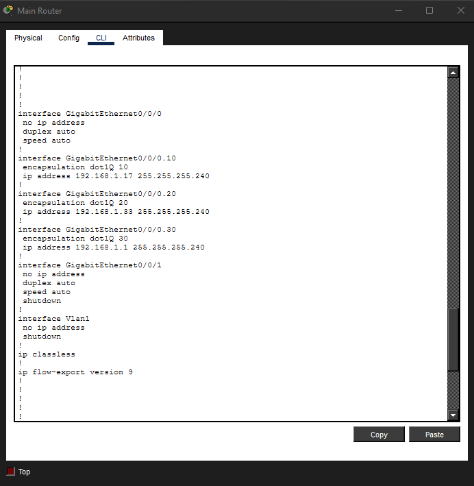
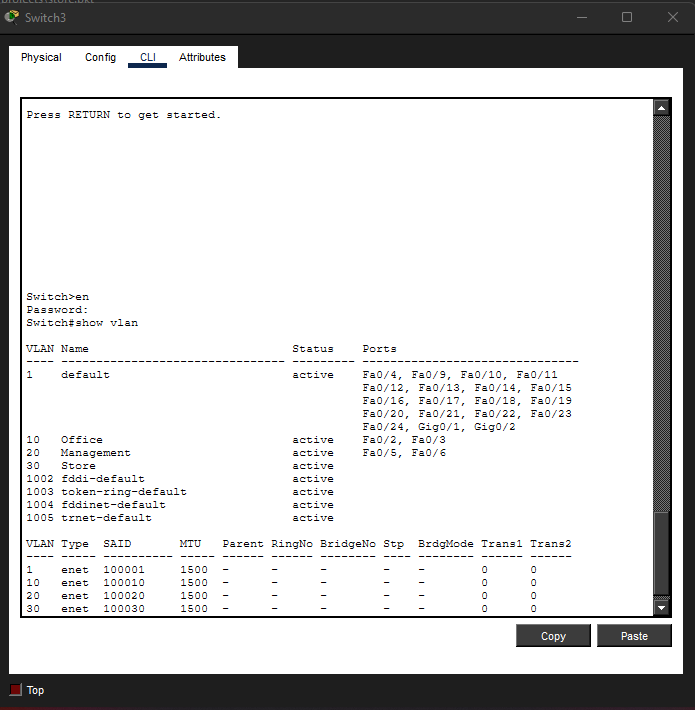
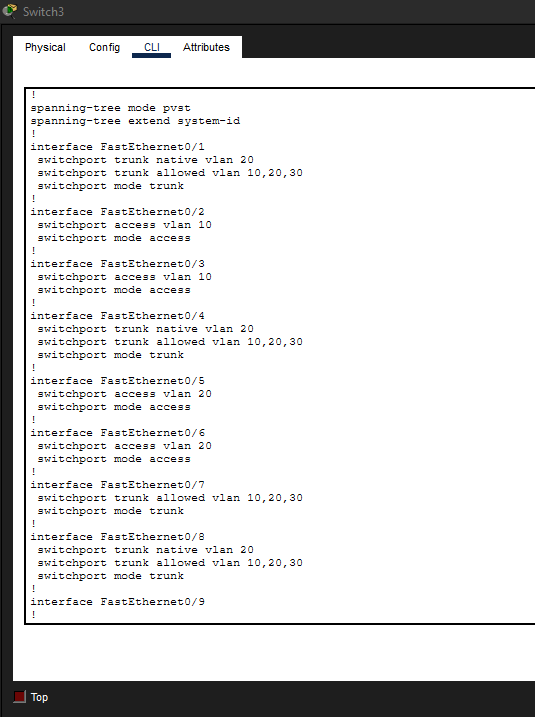
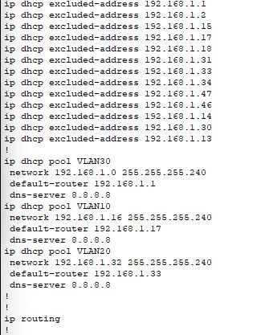
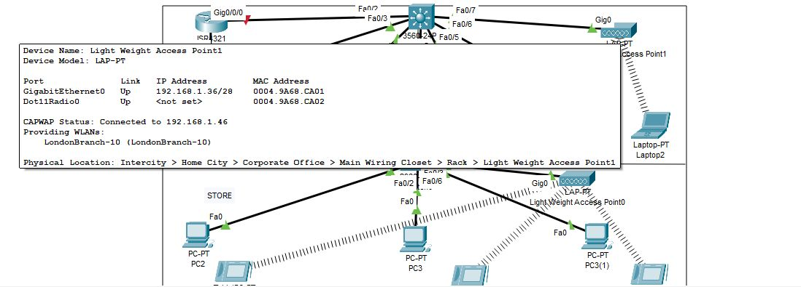

Active Directory and Routing Setup 
---
## Goal: Set-up Routing and Active Directory

The store was divided into three departments (Subsequently tweaked going forward):
* Management
* Office
* Store

Each department was assigned its own subnet and VLAN:
- VLAN 30 – Store – 192.168.1.0/28 (Gateway: 192.168.1.1)
- VLAN 10 – Office – 192.168.1.16/28 (Gateway: 192.168.1.17)
- VLAN 20 – Management – 192.168.1.32/28 (Gateway: 192.168.1.33)

Devices used:
- Multilayer switch (handles Layer 2 switching and Layer 3 routing)
- Access switch (extends connectivity to store devices)
- Wireless LAN Controller (WLC)
- Two lightweight access points
- End devices including PCs, laptops, tablets, and printers

---
Configuration process
---
1. Configured VLANs and SVI interfaces on the multilayer switch and enabled IP routing

## Main Switch - Router on a stick VLAN configuration
 

## Main Router - SVI configurations and 802.1Q VLAN trunking configurations
  
---
 

2. Created the same VLANs on the access switches to support VLAN trunking

## Access Switch - VLAN configurations
  
--- 
3. Set access ports for end devices and trunk ports between switches and LAPs to carry VLANs 10, 20, and 30.
4. Configured trunk links to the LAPs and WLC, with VLAN 20 set as the native VLAN for management traffic
## Access Switch - Access ports set for end device connections, trunk ports for connections between switches and LAPs, and Native trunk ports fr WLC management
  
--- 

5. Enabled DHCP on the multilayer switch and created pools for each VLAN, excluding static IPs reserved for management

With DHCP in place, both wired and wireless devices (including LAPs) successfully obtained IP addresses. Next, I configured the WLC.
---

## WLC setup:

1. Assigned a static IP from VLAN 20 and accessed the WLC via a web browser

.jpeg)
---

2. Created WLANs for management, office, and store departments
3. Formed WLAN groups and linked them with their respective WLANs and LAPs
4. Configured interfaces with VLAN IDs, names, and static IPs
6. Mapped each WLAN to the corresponding interface

This allowed each LAP to broadcast the appropriate SSID to its assigned VLAN, and wireless devices received DHCP IPs based on their assigned VLAN pools.
---

Issue encountered:
---
The LAPs initially connected to the WLC but later disconnected. I discovered a VLAN mismatch: VLAN 20 was set as the native (untagged) VLAN on the trunk link, but the WLC had VLAN 20 configured as tagged. After disabling VLAN tagging for the management interface on the WLC, connectivity was restored.

