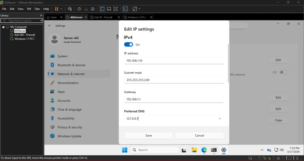
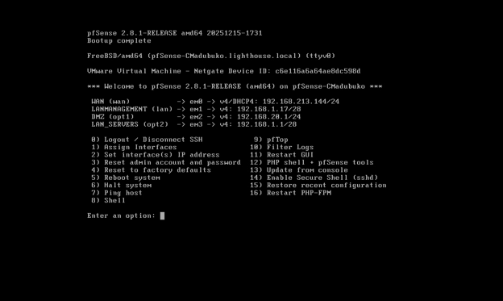
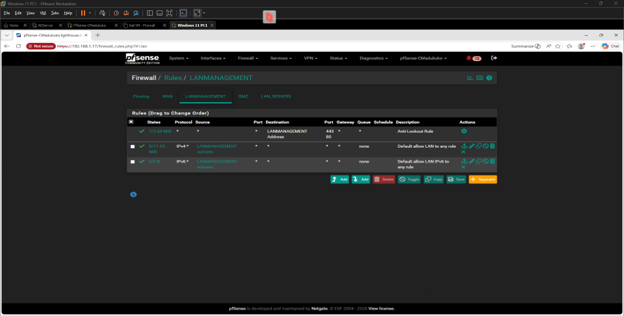
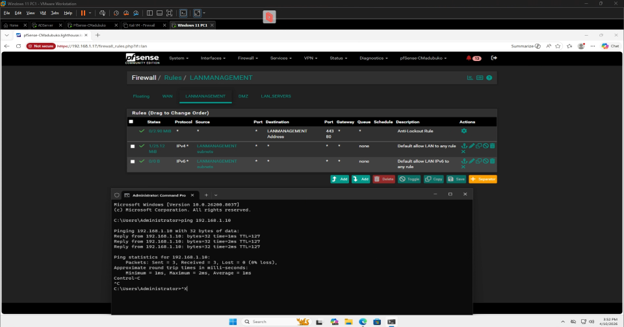

# Active Directory and Routing Setup 

#### Goal: Set-up Routing and Active Directory

In this one, the following VMs will be used
-	Server 2025 Standard – Active Directory  Server and Domain Controller(192.168.1.10)
    - Servers LAN Segment(192.168.1.0/28)

-	PfSense CE Firewall – Firewall and Router 
  EM0 -WAN (DYNAMIC - Internet)
  Em1 - LANMANAGEMENT(192.168.1.17)
  Em2(192.168.1.1)
  Opt1(192.168.1.33)
    - Internal Management Lan Segment (192.168.1.16/28)
    - Servers LAN Segment(192.168.1.0/28)
    - Office LAN Segment (192.168.1.32/28)

The goal of this lab is to setup and install Active directory Domain Services, set up the forrest, join the management pc to the domain and setup firewall and routing between the two networks.

## STEP1: STATIC IP CONFIGURATIONS

After installation, i assigned the interfaces to the correct networks and set up Static IP addresses for now..
-	Server Static IP

-	Management PC Static IP

-	PfSense Firewall IPs

-	Firewall Rules to permit traffic for now
Once that is completed, test connection fromManagement PC to Server

 
 

## Step2: INSTALLING ACTIVE DIRECTORY DOMAIN SERVICES ON THE SERVER AND SETTING UP THE FOREST
Now we would be installing the Active directory Domain Services using PoweShell cmdlet
#### Install-WindowsFeature -Name “AD-Domain-Services”
 

Creating a New Local Admin user for management
 

Starting the OpenSSH Server for Remote Management
-	To get the status of the OpenSSH Server I used te powershell command
Get-Service -Name “sshd”
-	To start the service, I used
Start-Service -Name “sshd”
 
Turn Off Firewall Profiles to allow SSH, Firewall rules will be added
-	Set-NetFirewallProfile -Profile Domain, Private, Public -Enabled False
-	Get-NetFirewallProfile | Select-Object Name, Enabled
 
Creating the forrest and promoting the SERVER to domain controller
 

Confirming the Server is part of the domain, DNS Resolution, Forest and Domain FSMO Roles
-	Active Directory confirmation
Get-ADDomainController -Identity “SERVER-AD”
-	DNS Resolution
Resolve-DNSName -Name “lighthouse.local”
-	Roles Confirmation
o	Forest-wide
Get-ADForest | Select-Object DomainNamingMaster, SchemaMaster
o	Domain-Wide
Get-ADDomain | Select-Object PDCEmulator, RIDMaster, InfrastructureMaster
 

Add the Domain Admin Account to Domain Admins Group, and remove it from local Admins Group
 

Creating a new user account
$FullName = Read-Host "Enter User Full Name: "
$FirstName = Read-Host "Enter User First Name: "
$LastName = Read-Host "Enter User Last Name: "
$UserName = Read-Host "Enter User User Name (firstInitial_Lastname): "
$PrincipalName = Read-Host "Enter User Principal Name: (username@lighthouse.local): "
$Password = Read-Host -AsSecureString "Enter User Temp Password: "

New-ADUser -Name "$FullName" `
-GivenName "$FirstName" `
-Surname "$LastName" `
-SAMAccountName "$UserName" `
-UserPrincipalName "$PrincipalName" `
-Path "CN=Users,DC=lighthouse,DC=local" `
-Server "SERVER-AD" `
-AccountPassword $Password `
-Enabled $true `
-ChangePasswordAtLogon $true
 

Enabling Remote Desktop 
 

